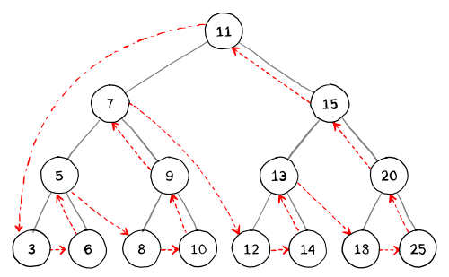
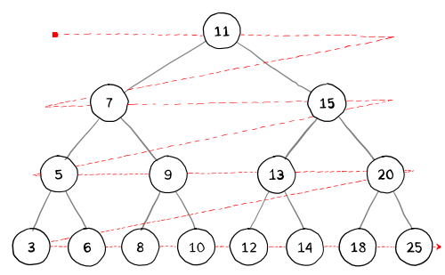

# Tree Traversal
**Tree traversal** (tree search) refers to the process of visiting each node in a tree exactly once.

Because from a given node there is more than one possible next node (not a linear data structure), then, assuming sequential computation (not parallel), some nodes _must_ be deferred—stored in some way for later visiting. This is often done via a [stack](https://en.wikipedia.org/wiki/Stack_(abstract_data_type)) (LIFO) or [queue](https://en.wikipedia.org/wiki/Queue_(abstract_data_type)) (FIFO). As a tree is a self-referential (recursively defined) data structure, traversal can be done by recursion or [corecursion](https://en.wikipedia.org/wiki/Corecursion); in these the cases the deferred nodes are stored implicitly in the [call stack](https://en.wikipedia.org/wiki/Call_stack).

**Depth-first search** is easily implemented via a stack, including recursively (via the call stack), while **breadth-first search** is easily implemented via a queue, including corecursively.

## Depth-first search (DFS)
**Depth-first search** is named as such because the search traverses the entire height of a node before going to the next sibling.

The general recursive pattern for traversing a binary tree is this: At node `N` do the following:

- **(L)** Recursively traverse its left subtree. This step is finished at the node `N` again.
- **(R)** Recursively traverse its right subtree. This step is finished at the node `N` again.
- **(N)** Process `N` itself.

_These steps can be done in any order. If **(L)** is done before **(R)**, the process is called left-to-right traversal, otherwise it is called right-to-left traversal._

The following methods show left-to-right traversal: **pre-order**, **in-order** and **post-order**.

### Pre-order (NLR)
  1. Check if the current node is empty or null.
  2. Display the data part of the root (or current node).
  3. Traverse the left subtree by recursively calling the pre-order function.
  4. Traverse the right subtree by recursively calling the pre-order function.

  

Pre-order: 11, 7, 5, 3, 6, 9, 8, 10, 15, 13, 12, 14, 20, 18, 25

The pre-order traversal is [topologically sorted](https://en.wikipedia.org/wiki/Topological_sorting) (linear order), because a parent node is processed before any of its child nodes is done.

### In-order (LNR)
  1. Check if the current node is empty or null.
  2. Traverse the left subtree by recursively calling the in-order function.
  3. Display the data part of the root (or current node).
  4. Traverse the right subtree by recursively calling the in-order function.

  

In-order: 3, 5, 6, 7, 8, 9, 10, 11, 12, 13, 14, 15, 18, 20, 25

In a [binary search tree](https://en.wikipedia.org/wiki/Binary_search_tree), in-order traversal retrieves data in sorted order.

### Post-order (LRN)
  1. Check if the current node is empty or null.
  2. Traverse the left subtree by recursively calling the post-order function.
  3. Traverse the right subtree by recursively calling the post-order function.
  4. Display the data part of the root (or current node).

  

Post-order: 3, 6, 5, 8, 10, 9, 7, 12, 14, 13, 18,25, 20, 15, 11

## Breadth-first search
Trees can also be traversed in _level-order_, where we visit every node on a level before going to a lower level.

  

Level-order: 11, 7, 15, 5, 9, 13, 20, 3, 6, 8, 10, 12, 14, 18, 25

[← go back to data structures/trees](../../data-structures/tree)