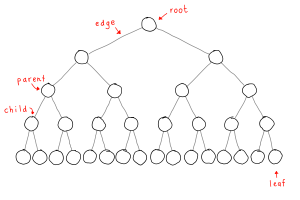
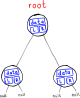

# Tree

A **tree** is a non-linear data structure that simulates a hierarchical tree structure.



## Contents
- [Overview](#overview)
- [Binary Tree](#binary-tree)
- [Binary Tree Node](#binary-tree-node)
- [Traversal](#traversal)
- [Terminology](#terminology)

## Overview

A tree is made up of **nodes** (or **vertices**) connected by (`n-1`) **edges** without having any cycle.

A tree that is not empty consists of a **root** node and potentially many **levels** of additional nodes that form a hierarchy.

If a node is connected to other nodes below it, that node is called the **parent** node, and the nodes following it are called **child** nodes.

## Binary Tree
Trees are commonly represented as **binary trees**, a structure that has two children, referred to as _left_ and _right_.

## Binary Tree Node
A node of a **binary tree** is represented by a structure containing data and two pointers to other structures of the same type.

```js
class Node {
  constructor(value = null) {
    this.value = value
    this.left = null
    this.right = null
  }
}
```


## Traversal
**Tree traversal** (tree search) refers to the process of visiting each node in a tree exactly once.

### Depth-first search (DFS)
There are three common ways to traverse a binary tree in depth-first order: **in-order**, **pre-order** and **post-order**.

## Terminology

#### Root
The top node in a tree.

#### Child
A node directly connected to another node when moving away from the root.

#### Parent
A node with other nodes connected below it.

#### Siblings
A group of nodes with the same parent.

#### Leaf
A node with no children.

#### Branch node
A node with at last one child.

#### Degree
For a given node, its number of children. A leaf is necessarily degree zero.

#### Edge
The connection between one node and another.

#### Path
A sequence of nodes and edges connecting a node with a descendant.

#### Level
The level of a node is defined as: 1 + the number of edges between the node and the root.

#### Depth
The depth of a node is defined as: the number of edges between the node and the root.

#### Height of node
The height of a node is the number of edges on the longest path between that node and a leaf.

#### Height of a tree
The height of a tree is the height of its root node.

#### Forest
A forest is a set of `n ≥ 0` disjoint trees.

<hr>

#### _References_

_[Wikipedia — Tree (data structure)](https://en.wikipedia.org/wiki/Tree_(data_structure))_

[↑](#contents)